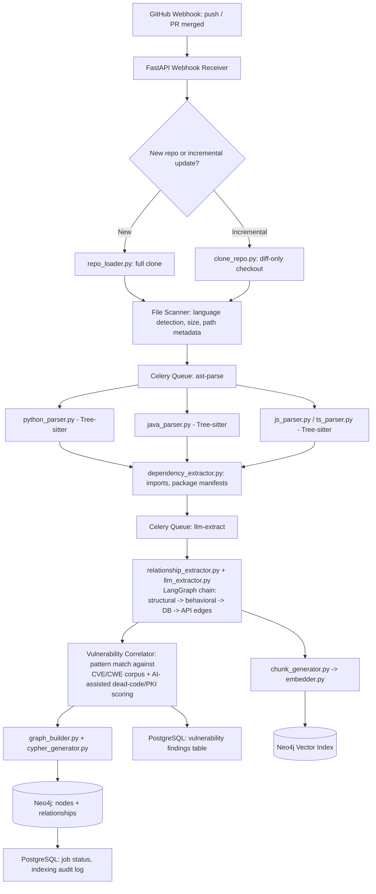
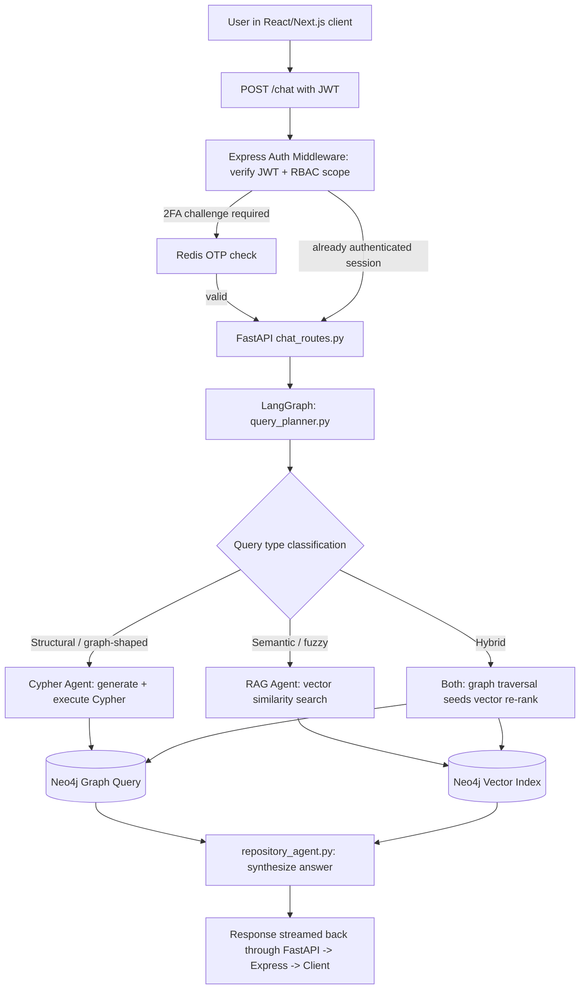

# Gitty AI: AI-Powered Repository Knowledge Graph Platform
## Enterprise Architecture Deep-Dive & Technical Research Report

**Prepared for:** ArcNixztech Engineering Leadership
**Classification:** Internal Architecture Review
**Scope:** Synthesis of the Gitty AI core specification with the "Galtiya" enterprise enhancement track (frontend, Node.js/Express auth layer, Redis OTP, and vulnerability intelligence)

---

## Table of Contents

1. Executive Summary & Market Context
2. Unified System Architecture & Data Flow
3. Deep-Dive Technical Component Breakdown
4. Development Phase Optimization & Timeline
5. References

---

## 1. Executive Summary & Market Context

### 1.1 The Thesis

Gitty AI is not another autocomplete layer bolted onto an editor. It is positioned a level below the IDE assistants that dominate developer mindshare today — a **persistent, queryable knowledge graph of a codebase's actual structure**, onto which AI agents, security tooling, and visualization layers are built. Where most AI coding products reason about a context window of recently-opened files, Gitty AI reasons about an explicit graph of `Files`, `Classes`, `Functions`, `Endpoints`, `Databases`, and the typed edges that connect them — `CALLS`, `IMPORTS`, `READS_FROM`, `EXPOSES_ENDPOINT` — materialized in Neo4j ahead of time. The "Galtiya" enhancement track adds the second half of the value proposition: this same graph becomes the system of record for an enterprise vulnerability and access-control program, fed by a Node.js/Express authentication layer with Redis-backed OTP and a chatbot interface that turns "what's wrong with this code" into a structured, auditable workflow.

### 1.2 Market Landscape

The AI-assisted development tooling category has moved well past the autocomplete era and into a fight over which product can claim genuine, repository-scale understanding. Market sizing places the AI code tools category at roughly $9.35 billion in 2026, on a trajectory to nearly $30 billion by 2031 at a CAGR above 26%, driven by foundation models crossing accuracy thresholds that let enterprises move from shadow-testing AI output to accepting agentic refactors with minimal manual review. The competitive set splits into three recognizable tiers: IDE-native incumbents (GitHub Copilot, still the broadest-adopted tool by raw user count), AI-first editors built around agentic workflows (Cursor, which scaled to billions in ARR largely by owning the developer desktop and shipping multi-file "Composer" style agents), and terminal/CLI-based reasoning agents (Claude Code, which developer surveys rank highest on satisfaction for architectural and multi-step work even though its raw seat count trails the incumbents).

The most structurally relevant competitor for Gitty AI's positioning is Sourcegraph Cody, precisely because Cody is the one major product built on an explicit **code graph** rather than a context window — it understands cross-service and cross-repository dependencies as a first-class data structure, and it leads the field on enterprise governance primitives like SSO, RBAC, audit logging, and self-hosted deployment. That is the lane Gitty AI is built to compete in, but with two differentiators the current graph-native incumbent does not foreground: (1) a security-and-vulnerability graph fused into the same Neo4j instance as the structural code graph, so "what calls this function" and "what CVEs touch this function's dependency chain" are answerable in a single Cypher traversal rather than two disconnected tools, and (2) a lighter-weight, FastAPI/Node.js hybrid stack that is easier for a mid-market engineering org to self-host than Sourcegraph's enterprise-only platform.

### 1.3 Why This Problem Is Expensive Today

Two cost curves justify the platform's existence, and they compound rather than sit side by side.

**The technical-debt curve.** Independent analysis of more than 10 billion lines of production code across 47,000 applications found that the world's accumulated technical debt would take roughly 61 billion developer workdays to repay — a backlog so large that putting all 25 million professional developers on the problem exclusively would still take nine years to clear. Stripe's Developer Coefficient research separately found that engineers lose on the order of 42% of a working week to technical debt and bad code, a productivity drain valued at close to $85 billion annually worldwide. Forrester's estimate that technical debt consumes 10–20% of new-product-development budget, and Gartner's warning that roughly half of enterprise applications still carry avoidable technical debt, both point at the same underlying failure: organizations cannot see their own codebases well enough to triage what to fix first. A knowledge graph that can answer "what is this function's blast radius" or "what has zero inbound callers" in milliseconds turns an invisible, qualitative debt problem into a queryable, prioritizable backlog.

**The shift-left-security curve.** Industry research on defect economics (originating with IBM's System Sciences Institute studies and reaffirmed across more recent security-ROI analyses) consistently shows that a vulnerability fixed during design or code review costs a small fraction — commonly cited figures range from roughly 15x to multiple orders of magnitude — of what the same defect costs once it reaches production, where remediation requires incident response, regression testing, and deployment coordination rather than a code review comment. The 2025 Cost of a Data Breach research puts the global average breach cost at roughly $4.4 million, climbing past $10 million for U.S. enterprises specifically. Despite this, most organizations still review only a small fraction of applications with meaningful threat modeling, largely because there are roughly 100 developers for every security engineer industry-wide. A platform that surfaces vulnerability context directly inside the same graph developers already query for "how does this code work" closes that staffing gap by routing security signal through the tool developers are already in, rather than a separate dashboard nobody opens.

### 1.4 Positioning Statement

Gitty AI's defensible position is **graph-native code intelligence with security correlation built into the schema, not bolted on as a separate product**. The platform competes with Cursor and Copilot on the AI-agent experience, with Sourcegraph Cody on graph-native architectural understanding, and with SAST/SCA vendors (Snyk, Semgrep-class tooling) on vulnerability visibility — but it is the only one of the three categories that stores all of this in a single property graph, which is what makes cross-domain queries like "show me every internet-facing endpoint that transitively depends on a function with a known CVE in its import chain" a single Cypher statement instead of a multi-tool correlation exercise performed by a human analyst.

---

## 2. Unified System Architecture & Data Flow

The platform has two operationally distinct lifecycles that share the same graph: an **ingestion/indexing lifecycle** (write path, mostly asynchronous) and a **query/chat lifecycle** (read path, synchronous and latency-sensitive). The Galtiya enhancements layer a Node.js/Express authentication boundary, a React/Next.js frontend, and Redis-backed OTP/MFA in front of both lifecycles, and inject a third lifecycle — the **vulnerability scan-and-chat loop** — that ties the dead-code/security tooling to the same agent infrastructure used for Q&A.

### 2.1 High-Level Component Map

```
┌─────────────────────────────────────────────────────────────────────────────┐
│                              CLIENT TIER                                     │
│   React.js + Next.js + Tailwind CSS  —  Graph Explorer, Chat UI, Vuln Board  │
└───────────────────────────────────┬───────────────────────────────────────--┘
                                     │ HTTPS / WSS
┌────────────────────────────────────▼──────────────────────────────────────--┐
│                     NODE.JS / EXPRESS — EDGE & AUTH LAYER                    │
│  REST Gateway · JWT Issuance · 2FA Orchestration (Redis OTP) · RBAC Guard    │
└──────────┬──────────────────────────────────────────────────┬─────────────--┘
           │ proxied / internal                                │ proxied
┌──────────▼───────────────────────┐               ┌───────────▼──────────────┐
│   FASTAPI — CORE PLATFORM API    │               │   REDIS (Cache + OTP)    │
│  Graph Routes · Chat Routes      │◄──────────────►│  OTP TTL store           │
│  Ingestion Triggers · Webhooks   │               │  Session cache            │
└──────────┬────────────────────────┘               └───────────────────────---┘
           │
           ▼
┌──────────────────────────────────────────────────────────────────────────--┐
│                  CELERY + RABBITMQ — ASYNC WORKER FABRIC                   │
│  repo-clone queue · ast-parse queue · llm-extract queue · embed queue      │
└──────────┬───────────────────────────────────────────────────────────────--┘
           │
   ┌───────┼────────────────┬────────────────────┬───────────────────────┐
   ▼       ▼                ▼                    ▼                       ▼
Repo     Tree-sitter    LLM Semantic        Embedder              Vulnerability
Loader   AST Parsers    Relationship        (BGE / OpenAI /       Correlator
(git)    (multi-lang)   Extractor (LLM)     Gemini embeddings)    (AI Model + PKI)
   │       │                │                    │                       │
   └───────┴────────────────┴────────────────────┴───────────────────────┘
                                     │
                                     ▼
                     ┌───────────────────────────────┐
                     │            NEO4J               │
                     │  Property Graph + Vector Index  │
                     └──────────────┬──────────────---┘
                                     │
                     ┌───────────────┼───────────────────┐
                     ▼               ▼                    ▼
              PostgreSQL      LangGraph Agent       Audit / RBAC store
              (users, repos,  Orchestrator           (PostgreSQL)
               metadata,      (Repository Agent,
               job state)      Cypher Agent, RAG)
```

### 2.2 Ingestion / Indexing Lifecycle (Write Path)

This is the path that converts a raw GitHub repository into graph state. It is intentionally asynchronous end-to-end — nothing in this path blocks a user-facing request.



**Narrative walk-through:** a GitHub webhook fires on push or PR merge and lands on the FastAPI webhook receiver. The repository loader decides between a full clone (first-time index) and a diff-only checkout (incremental update, scoped to changed files via the webhook's commit payload) — this distinction is what keeps re-indexing cheap on large monorepos. The file scanner classifies every file by language and routes it to the matching Tree-sitter grammar. AST output and the dependency extractor's import/manifest data merge and move into the LLM-extraction queue, where a LangGraph chain infers the relationship types that pure syntax cannot — *which* controller actually handles *which* endpoint, *which* service reads from *which* table — before the vulnerability correlator runs pattern and embedding-similarity matching against known CWE/CVE signatures. Everything converges in the graph builder, which emits Cypher through `cypher_generator.py` and commits nodes/relationships to Neo4j, while the chunking and embedding step populates the parallel vector index used for semantic retrieval.

### 2.3 Query / Chat Lifecycle (Read Path)



The critical design decision here is the **query classifier inside `query_planner.py`**: a question like "what calls `JwtService.refresh()`" is graph-shaped and should never touch the vector index — it is a deterministic Cypher traversal and should return in single-digit milliseconds. A question like "how does authentication work in this codebase" is semantic and ambiguous about exact node boundaries, so it needs vector retrieval to find candidate chunks before the agent reasons over them. Most production queries are hybrid: the planner uses an initial graph traversal to constrain the search space (e.g., "everything reachable from the `auth` directory") and then re-ranks within that constrained set using vector similarity — this is materially cheaper and more accurate than running an unconstrained vector search over the whole repository.

### 2.4 Vulnerability Scan-and-Chat Loop (Galtiya Enhancement)

```
 Scheduled / webhook-triggered scan
        │
        ▼
 Vulnerability Correlator (AI Model + PKI scoring)
        │
        ├──> writes (:Vulnerability) nodes + [:HAS_VULNERABILITY] edges into Neo4j
        ├──> writes finding rows into PostgreSQL (audit trail, SLA tracking)
        │
        ▼
 ChatBot Interface ("Galtiya AI") ─── user asks: "what's our exposure to CVE-2025-XXXX?"
        │
        ▼
 query_planner.py routes to Cypher Agent:
   MATCH (v:Vulnerability {cve_id:$cve})<-[:HAS_VULNERABILITY]-(f:Function)
   <-[:CONTAINS_FUNCTION*0..3]-(c)-[:EXPOSES_ENDPOINT]->(e:Endpoint)
   RETURN f, c, e
        │
        ▼
 Agent synthesizes blast-radius answer + suggested remediation
        │
        ▼
 User acknowledges / assigns / re-scans  ──> loop closes, status updated in PostgreSQL
```

This loop is the mechanism by which "dead code finder improvements backed by AI/PKI" and "vulnerability storage in the graph database" from the Galtiya notes become a single coherent product feature rather than two separate checkboxes: dead-code detection and vulnerability detection both run as graph queries against the same `CALLS` and `HAS_VULNERABILITY` edges, and both are surfaced through the same chat interface.

---

## 3. Deep-Dive Technical Component Breakdown

### 3.1 The Ingestion & AST Parsing Layer

**Multi-language handling.** Tree-sitter is the correct foundation for this layer precisely because it produces a concrete syntax tree via incremental, error-tolerant parsing — it does not require a file to be syntactically perfect to produce a usable tree, which matters enormously when ingesting real-world repositories that may contain in-progress edits, generated code, or files with minor lint violations. Each supported language (Python, Java, JavaScript, TypeScript, Go, C#, C++, PHP per the specification) gets its own grammar and its own thin extraction module (`python_parser.py`, `java_parser.py`, etc.) that walks the Tree-sitter tree and emits a language-agnostic intermediate representation: a flat list of `(node_type, name, span, parent_ref, language_specific_metadata)` tuples. This IR is what `graph_builder.py` actually consumes, which is the architectural decision that keeps the graph schema language-agnostic even though seven-plus language-specific parser modules exist underneath it.

**Edge cases that matter in production:**

| Edge Case | Failure Mode If Ignored | Mitigation |
|---|---|---|
| Generated/vendored code (`node_modules`, `.min.js`, protobuf output) | Graph bloats with noise nodes, query latency degrades, dead-code detection produces false positives | `.gittyignore` honoring `.gitignore` semantics plus a generated-file heuristic (header comment detection, path-pattern denylist) applied at the File Scanner stage, before parsing |
| Dynamic language constructs (Python `getattr`, JS dynamic `import()`, reflection in Java/C#) | Static AST cannot resolve the call target; relationship silently dropped | These cases are exactly why Layer 3 (LLM Semantic Relationship Extraction) exists as a second pass — the LLM is given the AST-resolved call graph plus surrounding source context and asked to infer probable dynamic targets, written back with a `confidence` property on the edge rather than treated as ground truth |
| Partial / unparseable files (syntax errors mid-refactor, merge conflict markers left in) | Whole-file parse failure blocks the pipeline | Tree-sitter's error-recovery parsing returns a best-effort tree with `ERROR` nodes scoped to the broken region; the extractor skips only the malformed subtree and still emits nodes for the rest of the file |
| Monorepos with 50k+ files | Full re-clone and full re-parse on every webhook event is cost-prohibitive | Incremental indexing keyed off the webhook's changed-file list (Phase 8 deliverable) — only the diff and its first-degree graph neighbors are re-parsed and re-written |
| Cross-language boundaries (Python service calling a Node.js service over HTTP) | No native AST edge exists between two different parser outputs | Modeled explicitly as `(:Endpoint)-[:HANDLES_REQUEST]->(:Function)` on the receiving side and `(:Function)-[:CALLS]->(:Endpoint)` on the calling side, inferred by the LLM extractor matching route strings/HTTP client calls rather than by AST traversal |

**Best practice:** parsing should be idempotent and content-addressed — each File node carries a content hash, and re-parsing a file whose hash has not changed is skipped entirely. This is what makes the "incremental updates" non-functional goal in the spec actually cheap rather than aspirational.

### 3.2 The Knowledge Graph Schema (Neo4j)

**Node labels and core properties.** The spec's base schema (Repository, Directory, File, Class, Interface, Function, Endpoint, Database, Package, Chunk) is extended by the Galtiya security track with three additional labels needed to make the auth and vulnerability features queryable inside the same graph rather than living only in PostgreSQL:

| Label | Key Properties | Origin |
|---|---|---|
| `:Repository` | `name`, `url`, `default_branch`, `last_indexed_at` | Core spec |
| `:Directory` | `path` | Core spec |
| `:File` | `name`, `path`, `language`, `size`, `content_hash` | Core spec |
| `:Class` | `name`, `visibility` | Core spec |
| `:Interface` | `name` | Core spec |
| `:Function` | `name`, `parameters`, `return_type`, `complexity_score` | Core spec |
| `:Endpoint` | `route`, `method`, `auth_required` | Core spec |
| `:Database` | `type`, `name` | Core spec |
| `:Package` | `name`, `version`, `license` | Core spec |
| `:Chunk` | `text`, `embedding`, `source_ref` | Core spec |
| `:Vulnerability` | `cve_id`, `cwe_id`, `severity`, `cvss_score`, `description`, `status`, `detected_at` | Galtiya security extension |
| `:User` | `user_id`, `role`, `mfa_enrolled` | Galtiya auth extension |
| `:ScanRun` | `run_id`, `started_at`, `tool_version`, `findings_count` | Galtiya security extension |

**Relationship catalog.**

| Relationship | From → To | Semantics |
|---|---|---|
| `HAS_DIRECTORY` | Repository / Directory → Directory | Filesystem containment |
| `HAS_FILE` | Directory → File | Filesystem containment |
| `CONTAINS_CLASS` | File → Class | Declaration containment |
| `CONTAINS_FUNCTION` | File / Class → Function | Declaration containment |
| `CALLS` | Function → Function | Behavioral call edge (carries `confidence` if LLM-inferred) |
| `IMPORTS` | File → Package / File | Dependency edge |
| `INHERITS` | Class → Class | Type hierarchy |
| `IMPLEMENTS` | Class → Interface | Contract fulfillment |
| `DEPENDS_ON` | Package → Package | Transitive dependency graph |
| `READS_FROM` / `WRITES_TO` | Function/Class → Database | Data-access edge |
| `CONNECTS_TO` | Service/Class → Database | Connection-level dependency |
| `EXPOSES_ENDPOINT` | Class → Endpoint | API surface |
| `HANDLES_REQUEST` | Endpoint → Function | Routing edge |
| `DESCRIBED_BY` / `SIMILAR_TO` / `SEMANTICALLY_RELATED` | Node → Chunk / Node → Node | AI layer, vector-derived |
| `HAS_VULNERABILITY` | Function/File/Package → Vulnerability | Security finding attachment |
| `DETECTED_BY` | Vulnerability → ScanRun | Provenance / audit trail |

**Cypher: dead code detection** (zero inbound `CALLS` edges, excluding entry points such as `main`, test files, and exported public API surfaces, which must be explicitly excluded or the query produces noisy false positives):

```cypher
MATCH (f:Function)
WHERE NOT EXISTS {
  MATCH (:Function)-[:CALLS]->(f)
}
AND NOT f.is_entry_point
AND NOT f.is_exported_public_api
RETURN f.name, f.path, f.complexity_score
ORDER BY f.complexity_score DESC
```

**Cypher: impact analysis** ("what breaks if `JwtService` changes" from the spec's future-features section, generalized to N-degree blast radius):

```cypher
MATCH (target:Class {name: $className})
MATCH (target)<-[:CALLS|USES|DEPENDS_ON*1..4]-(impacted)
OPTIONAL MATCH (impacted)-[:CONTAINS_FUNCTION]->(:Function)-[:EXPOSES_ENDPOINT]->(e:Endpoint)
RETURN DISTINCT impacted.name, impacted.path,
       collect(DISTINCT e.route) AS exposed_endpoints_at_risk
```

**Cypher: vulnerability blast-radius** (the query introduced conceptually in §2.4 — surfacing every internet-facing endpoint downstream of a known CVE):

```cypher
MATCH (v:Vulnerability {cve_id: $cveId})<-[:HAS_VULNERABILITY]-(start)
MATCH (start)<-[:CALLS|CONTAINS_FUNCTION*0..3]-(caller)
OPTIONAL MATCH (caller)-[:EXPOSES_ENDPOINT]->(e:Endpoint)
RETURN v.severity, v.cvss_score, start.name AS vulnerable_component,
       collect(DISTINCT e.route) AS exposed_routes,
       count(DISTINCT caller) AS internal_blast_radius
```

**Cypher: circular dependency detection** (a high-value extension not explicitly in the source spec but a natural fit for the same graph and frequently requested in enterprise audits):

```cypher
MATCH p = (a:Package)-[:DEPENDS_ON*2..6]->(a)
RETURN [n IN nodes(p) | n.name] AS cycle
```

**Schema design principle:** every relationship that originates from the LLM extraction stage (as opposed to deterministic AST parsing) carries a `confidence` float and a `source` property (`"ast"` vs `"llm_inferred"`). This is non-negotiable for an enterprise audit tool — when a vulnerability blast-radius report is used to justify an emergency patch window, the team needs to know which edges in that traversal are deterministic and which are probabilistic.

### 3.3 The Vector & Hybrid RAG Layer

Neo4j's native vector index removes the need for a separate vector database (Pinecone, Weaviate, etc.) by storing `embedding` as an indexed property directly on `:Chunk`, `:Function`, and `:Class` nodes, which means a single query can combine a `CALL db.index.vector.queryNodes(...)` similarity search with a graph pattern match in the same Cypher statement — this is the structural advantage a graph-native RAG layer has over a standalone vector store, where joining "semantically similar to X" with "structurally connected to Y" requires an application-layer join across two systems.

**LangGraph agent orchestration.** The agent layer is not a single LLM call with a long system prompt; it is a graph of specialized nodes, mirroring the "Multi-Agent System" future feature in the source spec:

```
START
  │
  ▼
query_planner (classifies intent: structural / semantic / hybrid / generative)
  │
  ├──> cypher_agent ──> validates generated Cypher against schema before execution
  │                       (prevents the classic LLM-Text2Cypher failure mode of
  │                        hallucinating relationship types that don't exist)
  │
  ├──> rag_agent ──> retriever.py: vector search + graph-seeded re-rank
  │
  ├──> documentation_agent ──> README / sequence-diagram generation
  │
  └──> architecture_agent ──> synthesizes controller→service→repository→database
                                chains into Mermaid output for the visualization layer
  │
  ▼
synthesis node (merges sub-agent outputs, attaches source citations to graph nodes)
  │
  ▼
END
```

The `cypher_agent`'s schema-validation step is the single highest-leverage reliability investment in this layer: an LLM asked to write Cypher against a graph it has never directly queried will, with non-trivial frequency, invent relationship names that sound plausible (`CALLS_FUNCTION` instead of `CALLS`) or assume a property exists that does not. Validating generated Cypher against the live Neo4j schema (via `CALL db.schema.visualization()` or an equivalent introspection call) before execution, and feeding validation failures back into the agent as a retry signal, is what separates a demo-quality Text2Cypher feature from a production one.

### 3.4 The Enterprise Security & Auth Layer

This is the layer that most directly operationalizes the Galtiya handwritten notes: 2FA Multi, Redis OTP, fingerprint/biometric simulation, vulnerability storage, and the chatbot-to-vulnerability-scan loop.

**Authentication flow:**

```
1. Client (Next.js) submits credentials to Express /auth/login
2. Express validates credentials against PostgreSQL (bcrypt/argon2 hash compare)
3. Express generates a 6-digit OTP, writes it to Redis with a short TTL:
       SET otp:{user_id} {otp_code} EX 300
4. OTP delivered out-of-band (email/SMS provider) or via simulated biometric
   challenge for the fingerprint-simulation flow
5. Client submits OTP to /auth/verify-otp
6. Express reads Redis key, compares, deletes key on success (single-use enforcement)
7. On success: Express issues a short-lived JWT (access token) + refresh token,
   refresh token persisted in PostgreSQL with rotation tracking
8. Subsequent requests to FastAPI carry the JWT; Express acts as the
   token-issuing authority while FastAPI validates and trusts it (shared
   signing secret or JWKS endpoint) — this keeps the Node.js layer as the
   single source of truth for identity without forcing FastAPI to own auth
```

**Why Redis specifically for OTP, not PostgreSQL:** OTPs are write-heavy, short-TTL, single-use values that should auto-expire without a cleanup job — Redis's native `EX` flag and O(1) key operations make it the correct fit, and it is already in the stack as the Celery broker's companion cache, so no new infrastructure dependency is introduced. The biometric/fingerprint "simulation" referenced in the notes should be implemented as a pluggable challenge provider behind the same `/auth/verify-otp` contract (a WebAuthn-compatible interface is the production-grade target even if the initial implementation simulates the device attestation step), so that swapping in real WebAuthn later does not require touching the OTP/Redis core.

**Vulnerability storage schema and CVE correlation.** Findings flow into both PostgreSQL (for tabular audit/SLA tracking — who acknowledged what, when, with what remediation deadline) and Neo4j (for graph-contextual queries — blast radius, co-located vulnerabilities, dependency-chain exposure). The correlation mechanism the notes describe as "AI Models / PKI" maps to a two-stage process: a fast deterministic stage matches package/version strings against a CVE feed (NVD-style data) for known-vulnerable dependencies, and a slower LLM-assisted stage performs pattern-based static analysis against CWE categories (SQL injection shape, hardcoded secrets, unsafe deserialization) for first-party code that has no CVE because it was never publicly disclosed — this second stage is genuinely AI-differentiated and is where the "dead code finder improvements backed by A.I." line item lives, since unreachable code with security flaws is lower priority to patch than reachable code with the same flaw, and only a graph traversal (not a flat SAST scanner) can tell the difference.

**RBAC enforcement.** Every Cypher query executed on behalf of a user is scoped server-side by repository ACL stored in PostgreSQL and enforced as a parameter injected into the query at the `cypher_agent` validation step (`WHERE r.repository_id IN $allowed_repo_ids`), never trusted from client input — this prevents a class of authorization bypass where a sufficiently clever natural-language prompt could otherwise induce the agent to generate a Cypher query that reaches across repository boundaries the user does not have access to.

---

## 4. Development Phase Optimization & Timeline

The specification's eight phases form a coherent roadmap, but several carry hidden bottlenecks that only surface at repository scale. The table below synthesizes the original phase plan with bottleneck analysis and concrete mitigations, and folds the Galtiya enterprise-security workstream into Phase 8 rather than treating it as a bolt-on afterthought, since auth and vulnerability storage touch the schema decisions made as early as Phase 3.

| Phase | Goal | Duration | Primary Bottleneck at Scale | Mitigation |
|---|---|---|---|---|
| 1. Repository Ingestion | Clone repos, scan files | 1 week | Full clones of multi-GB monorepos saturate worker I/O and stall the queue | Shallow clone (`--depth=1`) by default; sparse checkout for monorepos scoped to changed paths on webhook-triggered re-indexes |
| 2. AST Parsing | Multi-language structural understanding | 2 weeks | Parser coverage gaps on less-common languages silently drop entire files from the graph | File Scanner emits an explicit `unparsed_files` report per indexing run so coverage gaps are visible, not silent; unsupported files still get a `:File` node with `language: "unknown"` so the directory structure stays complete even when content parsing fails |
| 3. Knowledge Graph | Populate Neo4j with nodes/relationships | 1 week | Naive write patterns (one transaction per node) collapse under monorepo node counts (100k+ nodes) | Batched `UNWIND` writes via `cypher_generator.py`, with constraints/indexes (`CREATE CONSTRAINT ... IS UNIQUE`) created before bulk load, not after |
| 4. LLM Semantic Layer | Infer hidden relationships (call chains, DB usage) | 2 weeks | LLM API rate limits and per-token cost scale linearly with file count; a 10k-file repo can mean tens of thousands of extraction calls | Batch multiple functions per LLM call with structured-output prompting; cache extraction results keyed by content hash so unchanged code is never re-sent to the LLM on incremental updates; route low-ambiguity cases (clear static imports) through the deterministic AST path entirely, reserving LLM calls for genuinely ambiguous dynamic-dispatch cases |
| 5. Embeddings | Semantic search via chunk vectors | 1 week | Re-embedding the entire repository on every incremental update is wasteful and slow | Embed only changed chunks (content-hash-gated, same pattern as parsing); maintain embedding-model versioning so a model upgrade can trigger a scoped re-embed rather than requiring a full re-index |
| 6. Repository Agent | LangGraph chat agent, Cypher generation, retrieval | 2 weeks | Text2Cypher hallucination (invented relationship types/properties) produces confident-sounding wrong answers | Schema-validated Cypher generation with retry-on-validation-failure (§3.3); few-shot examples drawn from the live schema rather than generic Cypher examples |
| 7. Visualization | Interactive graph explorer | 2 weeks | Rendering 10k+ node graphs in a browser (React + Cytoscape.js) causes severe frame-rate degradation | Server-side graph summarization/clustering (collapse a directory subtree to a single expandable node) before sending to the client; progressive disclosure rather than rendering the full graph on initial load |
| 8. Enterprise Features (incl. Galtiya security track) | Incremental indexing, multi-user, RBAC, background jobs, GitHub webhooks, 2FA/OTP, vulnerability storage | 3 weeks → realistically 4–5 weeks once the security workstream is included | Webhook-driven incremental indexing can race with itself if two pushes land before the first indexing job completes, corrupting graph state; auth/RBAC retrofitted onto a schema designed without it requires reworking every query path | Idempotent, content-hash-gated writes (so a duplicate/overlapping job is a no-op rather than a corruption risk); a per-repository indexing lock in Redis so concurrent webhook events queue rather than race; design the RBAC scoping parameter into `cypher_agent` from Phase 6 rather than Phase 8, even if enforcement is stubbed out until the auth layer ships, so the query-generation contract never has to change shape later |

**Cross-cutting bottleneck: rate-limiting during LLM relationship extraction.** This deserves emphasis beyond the table because it is the single largest cost and latency driver in the entire pipeline at enterprise scale. The mitigation strategy is threefold: maximize the share of relationships resolved deterministically by the AST layer so the LLM is only invoked for genuine ambiguity; batch extraction requests using structured-output (JSON-schema-constrained) prompting so one LLM call resolves many candidate relationships instead of one; and treat extraction as fully content-hash-cacheable so a 50,000-file repository's first index is expensive but every subsequent incremental update only pays the LLM cost for the files that actually changed.

**Cross-cutting bottleneck: keeping graph updates incremental via webhooks.** The naive implementation — re-clone and re-parse the full repository on every push — defeats the entire point of incremental indexing and will not survive contact with a real engineering org's commit velocity. The webhook payload's list of changed files should drive a scoped re-parse of exactly those files plus their first-degree graph neighbors (functions that call into a changed function need their `CALLS` edges re-validated even though their own source did not change), with the Redis-backed per-repository lock preventing two overlapping webhook events from writing inconsistent partial state to the same repository's subgraph simultaneously.

---

## 5. References

- Mordor Intelligence, *Artificial Intelligence (AI) Code Tools Market Size, Share & 2031 Trends Report*, updated through January 2026 — https://www.mordorintelligence.com/industry-reports/artificial-intelligence-code-tools-market
- Sitepoint, *Cursor vs Claude Code vs Cody: Best AI IDE for 2026* — https://www.sitepoint.com/ai-ides-compared-cursor-claude-code-cody-2026/
- Ideaplan, *AI Coding Assistant Market Share 2026: Cursor vs Copilot* — https://www.ideaplan.io/blog/ai-coding-assistant-market-share-2026
- CAST Software, *Coding in the Red: The State of Global Technical Debt 2025* — https://www.castsoftware.com/ciu/coding-in-the-red-technical-debt-report-2025
- TinyMCE, *Opportunity Cost of Technical Debt* (citing Stripe's Developer Coefficient report) — https://www.tiny.cloud/technical-debt-whitepaper/
- Pega/Savanta, *Average Global Enterprise Wastes More Than $370 Million Every Year Through Technical Debt* — https://www.pega.com/about/news/press-releases/average-global-enterprise-wastes-more-370-million-every-year-through
- Eluminous Technologies, *The Strategic Guide to Technical Debt 2025* (citing Gartner) — https://eluminoustechnologies.com/blog/technical-debt/
- Medium / Patrick Lefler, *The ROI of Shifting Security Left* (citing IBM System Sciences Institute research) — https://medium.com/@patrick.lefler/the-roi-of-shifting-security-left-d0c9f893753f
- AlleyWatch, *Prime Security Raises $20M to Scale Design-Stage Security Reviews with AI Agents* — https://www.alleywatch.com/2025/12/prime-security-product-design-stage-management-agentic-ai-security-architect-michael-nov/
- TuxCare, *The Real-World Cost of Not Patching a Critical CVE* (citing IBM's 2025 Cost of a Data Breach Report) — https://tuxcare.com/blog/the-real-world-cost-of-not-patching-a-critical-cve-a-security-roi-perspective/
- DevOps.com, *The Cost of Not Building with Security in Mind* (citing IEEE Computer Society) — https://devops.com/cost-not-building-software-security-mind/
- Source materials synthesized: *GITTY - Ai* core specification (uploaded PDF) and ArcNixztech "Galtiya" handwritten enhancement notes (uploaded sketch)

---

*This document synthesizes the uploaded Gitty AI specification and Galtiya enhancement sketches into a unified enterprise architecture. Figures cited in Section 1 are drawn from third-party market and security research current as of mid-2026 and should be re-verified against primary sources before use in external-facing materials or financial projections.*
